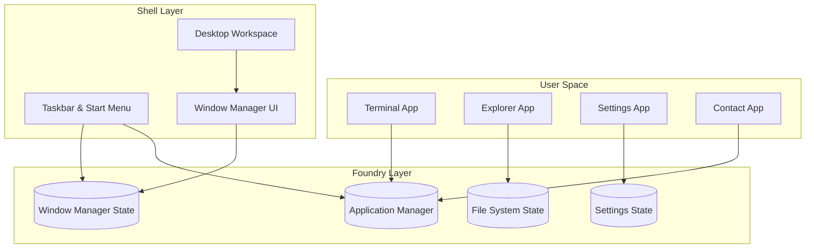

# PrathamOS Architecture

PrathamOS is structured around a strict separation of concerns, simulating a traditional operating system architecture entirely within the browser.

## High-Level Architecture Diagram

## Layers

### 1. Foundry (Kernel)
The Foundry handles all abstract logic, state, and permissions. It has absolutely no knowledge of React UI components, CSS, or DOM elements. It is comprised of four primary managers:
- **Application Manager**: Maintains the registry of installed applications (`AppManifest`).
- **Window Manager**: Maintains the array of open windows, z-index ordering, positions, sizes, and focus state.
- **File System**: Maintains the immutable virtual file tree.
- **Settings Manager**: Maintains global OS configurations (wallpaper, theme, animations).

### 2. Shell (Windowing & Desktop Environment)
The Shell consumes the Foundry state to render the physical OS. 
- It handles translating window coordinates to `framer-motion` properties.
- It provides drag-and-drop contexts.
- It manages z-index application and focus listening.
- It implements accessibility wrappers globally (e.g., trapping focus in modals, Escape-to-close behavior).

### 3. User Space (Applications)
User space applications are highly isolated React components. 
- They **cannot** import other applications.
- They **cannot** directly mutate global state without using a Foundry context.
- They exist within a sandbox (the `WindowFrame`) which handles their lifecycle.

## Engineering Rules
1. **Zero Prop Drilling**: All cross-component state flows through React Contexts defined in the Foundry.
2. **Strict File Size**: No component exceeds 250 LOC.
3. **No `any` Types**: 100% strict TypeScript compliance.
4. **Isolated Renders**: High-frequency updates (like the clock) are isolated to their own state trees to prevent global React renders.
